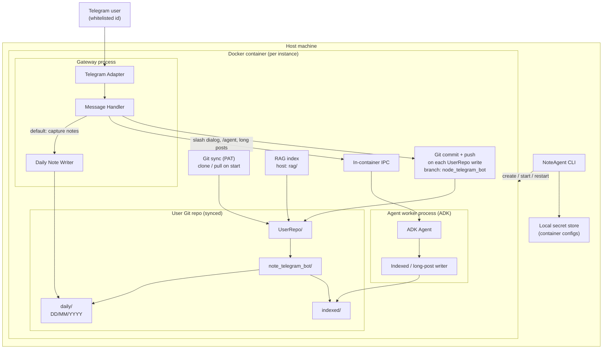

# NoteAgent

Telegram-based personal note bot with a Docker-isolated runtime, Git-backed note storage, and an LLM agent (Google ADK) for indexing, long posts, and custom slash commands.

## What it does (planned)

1. **CLI** — On start, choose an existing Docker container or create a new one (container name, Telegram bot token, LLM API key, allowed Telegram user id, Git PAT, repo URL). Persist settings in a local secret store. List running containers; add or restart instances.
2. **Isolated runtime** — One Docker container per user instance runs **two processes**: a **gateway** (Telegram + handler + fast note/Git path) and an **ADK agent worker** (slash dialogs, long posts, command authoring). Gateway talks to the worker over in-container IPC.
3. **Git sync** — Inside the container only: clone/sync into host-mounted `UserRepo/`, scaffold `note_telegram_bot/`, commit + push on each write and on gateway shutdown. The host CLI never runs `git`.
4. **Default behavior** — Most Telegram messages are appended to daily note files; slash commands open timed agent dialogs (3-minute window) without writing to daily notes until the dialog ends.
5. **RAG** — Per-instance vector index on the host (`rag/`); indexes **all of `UserRepo/`** except `note_telegram_bot/config/`; chunking and search strategies in [PRODUCT_SPEC.md](PRODUCT_SPEC.md) (RAG section). Reconcile after git pull and local writes.

## Planned architecture

The diagram below reflects the component split described in [PRODUCT_SPEC.md](PRODUCT_SPEC.md) and [DEVELOPMENT_ROADMAP.md](DEVELOPMENT_ROADMAP.md).



### Component responsibilities

| Component | Role |
|-----------|------|
| **CLI** | Container lifecycle, prompts for secrets, list/restart instances |
| **Telegram Adapter** | Receive and send Telegram messages |
| **Gateway** | Telegram + handler: default note capture, Git push triggers, RAG reconcile hooks; forwards agent work to worker |
| **Agent worker (ADK)** | Slash dialogs, `/agent`, long posts, indexed files, user commands/tasks, KB tools |
| **Daily Note Writer** | Append lines to `daily/DD/MM/YYYY` (day boundary 06:00 local) |
| **Git sync / push** | Pull on start; commit + push on every `UserRepo/` change; push on gateway SIGTERM (container only) |
| **RAG** | Host-mounted chunk index + mtime registry; full `UserRepo/` except `config/`; daily = log-line chunks; other paths = multi-chunk (see spec); hybrid search for retrieval |

## Repository layout (inside user repo)

```
UserRepo/
  note_telegram_bot/
    daily/          # raw daily lines, e.g. 02_Jun_2026.md (DD_MMM_YYYY)
    indexed/        # long posts, /<CommandName> outputs, wikilinked notes
    config/         # timezone, commands/, tasks/, … (not in RAG index)
```

All other paths under `UserRepo/` (including user files outside `note_telegram_bot/`) are indexed in RAG per [PRODUCT_SPEC.md](PRODUCT_SPEC.md); only `note_telegram_bot/config/` is excluded.

Git branch (e.g. `node_telegram_bot`) is **created if missing** after clone/pull.

## Default slash commands

| Command | Purpose |
|---------|---------|
| `/agent` | Dialog — re-index KB, KB Q&A (RAG top-k + summarize), add custom commands/tasks |
| `/commands` | List default and user-defined commands |
| `/Schedule` | List all `<task>` entries and cron schedules for user commands |

User-defined commands are added over time via the agent and registered in the handler (see [PRODUCT_SPEC.md](PRODUCT_SPEC.md)).

## Daily note format

| Rule | Value |
|------|--------|
| File | `note_telegram_bot/daily/DD_MMM_YYYY.md` |
| Logical day | 06:00 → 06:00 (user timezone; prompt once if unknown) |
| Order | Top = morning, bottom = evening |
| Line | `HH:mm:<Index> <type> <Note>` |
| Note id | `YYYY:MMM:DD:HH:mm:<Index>` (`Index` = 00, 01, … within the same minute) |

**`<AILogs>`** (command output files): same full id prefix as note id — `YYYY:MMM:DD:HH:mm:<Index> <type> <Note>` (see [PRODUCT_SPEC.md](PRODUCT_SPEC.md)).

**Types (optional):** omitted for normal notes; `Long filename.md` for messages over 60 words (summary in daily, body in `indexed/`); `forwarded from @telegramNickName` (and combined long-forward variants); `Summary from date to date` in indexed command outputs.

## Tech stack

- **Runtime:** Node.js ≥ 18, TypeScript
- **Agent:** [Google Agent Development Kit (ADK)](https://adk.dev)
- **Deploy:** Docker (one container per configured instance)
- **Messenger:** Telegram Bot API

## Install and run

### Prerequisites

- [Node.js](https://nodejs.org/) **18+**
- [Docker](https://www.docker.com/) (Desktop on Windows/macOS, Engine on Linux) — running before you add or start instances

### Setup (once per machine)

From the project directory:

```bash
npm install
npm run build
```

This builds the host CLI (`dist/cli/`) and the container runtime (`dist/runtime/`, `dist/messenger/`).

### Run the bot (normal use)

```bash
npm start
```

The CLI menu lets you:

1. **Add instance** — wizard: container name, Telegram bot token, LLM provider + API key, your Telegram user id, Git PAT, repo URL. Data is stored in `~/.note-agent/instances.json` (secrets) and host folders under `~/.note-agent/instances/<containerName>/`.
2. **Start** or **Restart** an instance — CLI builds the Docker image if needed, creates/starts the container. Inside the container, **gateway** and **agent worker** start automatically (you do not run them separately).
3. **Delete instance** — removes the container and registry entry; optional wipe of host `UserRepo/` and `rag/`.

Send messages to your bot on Telegram. By default they are saved to `note_telegram_bot/daily/` and pushed to Git.

### After you change the code

```bash
npm run build
docker build -t note-agent-runtime:latest .
```

Then in the CLI: **Restart** the instance (or **Start** if stopped) so the container is recreated with the new image.

### Optional: local debugging without Docker

Only for hacking on gateway/worker — not for daily use. You need the same env vars the container sets (`NOTE_AGENT_*`, `TELEGRAM_BOT_TOKEN`, `GIT_PAT`, `LLM_API_KEY` on the worker). Run **both** in separate terminals:

```bash
npm run start:gateway
npm run start:agent-worker
```

Process boundaries: [docs/runtime-boundaries.md](docs/runtime-boundaries.md).

### Development checks

```bash
npm run typecheck
npm test
```

## License

MIT
