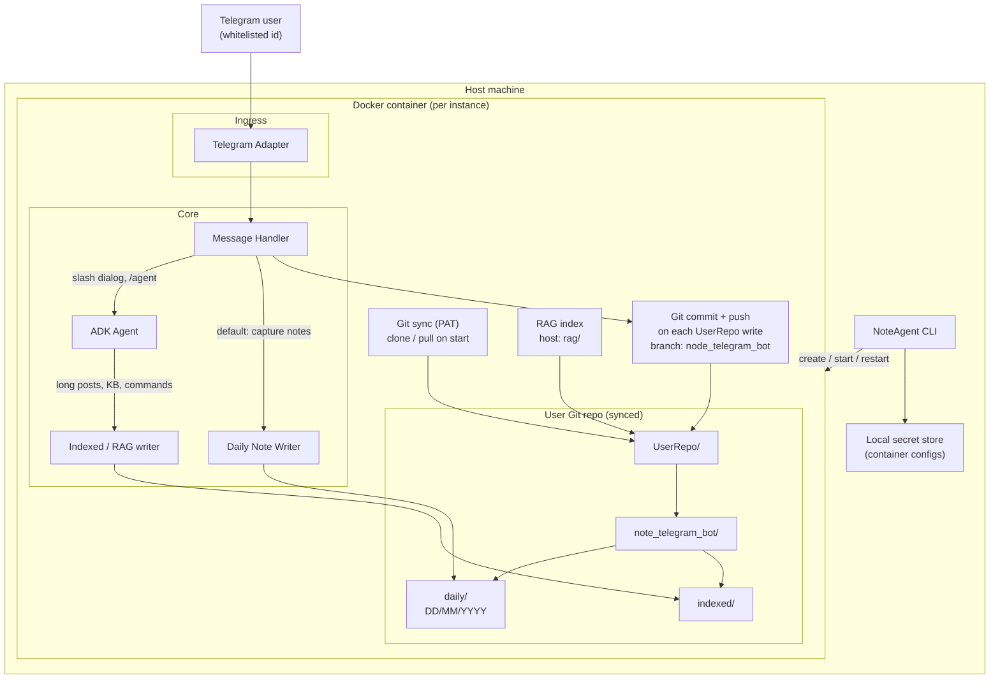
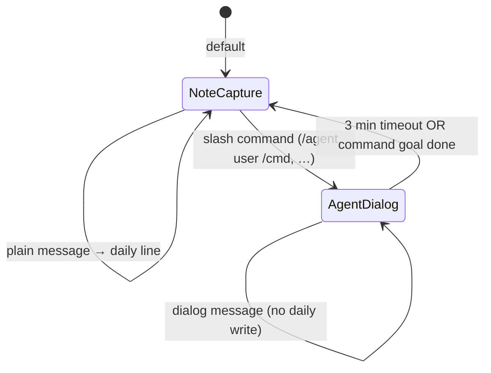

# NoteAgent

Telegram-based personal note bot with a Docker-isolated runtime, Git-backed note storage, and an LLM agent (Google ADK) for indexing, long posts, and custom slash commands.

**Status:** early development — CLI scaffold and messenger types exist; container orchestration, handler, agent, and Git sync are planned per [PRODUCT_SPEC.md](PRODUCT_SPEC.md).

## What it does (planned)

1. **CLI** — On start, choose an existing Docker container or create a new one (container name, Telegram bot token, LLM API key, allowed Telegram user id, Git PAT, repo URL). Persist settings in a local secret store. List running containers; add or restart instances.
2. **Isolated runtime** — The full service (Telegram adapter, message handler, agent) runs inside one Docker container per user instance.
3. **Git sync** — After container start, clone/sync the user repo via PAT into host-mounted `UserRepo/`; ensure `note_telegram_bot/` exists. On each write: commit + push to the instance branch (e.g. `node_telegram_bot`). Before CLI restart: push pending commits.
4. **Default behavior** — Most Telegram messages are appended to daily note files; slash commands open timed agent dialogs (3-minute window) without writing to daily notes until the dialog ends.
5. **RAG** — Per-instance vector index on the host (`rag/`); reconciled with `UserRepo/` after local writes and after git pull.

## Planned architecture

The diagram below reflects the component split described in [PRODUCT_SPEC.md](PRODUCT_SPEC.md). Command routing, ADK tools, and script runners are detailed further in `Requirements/SmartCommandBuilding.md` (local spec, if present).



### Component responsibilities

| Component | Role |
|-----------|------|
| **CLI** | Container lifecycle, prompts for secrets, list/restart instances |
| **Telegram Adapter** | Receive and send Telegram messages |
| **Message Handler** | Default note capture; route `/` commands; 3-minute dialog timeout; ignore non-whitelisted users |
| **ADK Agent** | Index knowledge base, create user commands/tasks, long-post summaries, RAG links |
| **Daily Note Writer** | Append lines to `daily/DD/MM/YYYY` (day boundary 06:00 local) |
| **Git sync / push** | Pull on start; commit + push on every `UserRepo/` change; push before container stop |
| **RAG** | Host-mounted index; reconcile mtime with `UserRepo/` after writes and pull |

### Handler modes



## Repository layout (inside user repo)

```
UserRepo/
  note_telegram_bot/
    daily/          # raw daily lines (DD_MMM_YYYY.md files)
    indexed/        # full posts and processed notes
    config/         # planned: user timezone, commands.json, tasks.json, …
```

## Default slash commands

| Command | Purpose |
|---------|---------|
| `/agent` | Dialog with agent (“agent is listening”) — index KB, add custom commands/tasks |
| `/commands` | List default and user-defined commands |
| `/Schedule` | List all `<task>` entries and cron schedules for user commands |

User-defined commands are added over time via the agent and registered in the handler (see SmartCommandBuilding spec).

## Daily note format

| Rule | Value |
|------|--------|
| File | `note_telegram_bot/daily/DD_MMM_YYYY.md` |
| Logical day | 06:00 → 06:00 (user timezone; prompt once if unknown) |
| Order | Top = morning, bottom = evening |
| Line | `HH:MM:<Index> <type> <Note>` |
| Note id | `YYYY:MM:DD:HH:MM:<index>` (`Index` = 00, 01, … within the same minute) |

**Types (optional):** omitted for normal notes; `Long filename.md` for messages over 60 words (summary in daily, body in `indexed/`); `forwarded from @telegramNickName` (and combined long-forward variants); `Summary from date to date` in indexed command outputs.

## Tech stack

- **Runtime:** Node.js ≥ 18, TypeScript
- **Agent:** [Google Agent Development Kit (ADK)](https://adk.dev)
- **Deploy:** Docker (one container per configured instance)
- **Messenger:** Telegram Bot API

## Requirements

Full product specification (English, tracked in git): [PRODUCT_SPEC.md](PRODUCT_SPEC.md).

Editable source (local, often gitignored): `Requirements/Main.md`. Extended command/script design: `Requirements/SmartCommandBuilding.md`.

## Development

```bash
npm install
npm run build
npm start
```

## License

MIT
